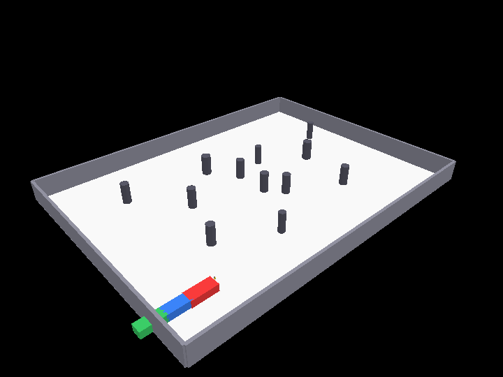

# G2T — Path-planning y SLAM (IPD-482, Guía 3)

> **Notice**
>
> Este repositorio, así como su estructura, organización y documentación, fue reordenado y estandarizado con apoyo de herramientas de Inteligencia Artificial con el objetivo de facilitar su revisión y corrección.
>
> Debido a este proceso, algunos comentarios, nombres de secciones o decisiones de organización pueden parecer más estructurados o artificiales de lo que normalmente surgiría durante el desarrollo original. Sin embargo, todo el contenido proviene de códigos y resultados generados durante la realización de la tarea, los cuales fueron desarrollados de forma incremental y, en muchos casos, sin una estructura uniforme inicial.
>
> El propósito de esta reorganización fue exclusivamente mejorar la legibilidad, trazabilidad y mantenibilidad del repositorio, preservando la lógica, resultados y decisiones técnicas implementadas en la versión original del trabajo.

Flujo de procesamiento de extremo a extremo para un sistema N-trailer generalizado (tractor + dos remolques, "G2T") en **CoppeliaSim** que:
1. **simula** el vehículo articulado y un LiDAR 2D nativo (SICK S300) en CoppeliaSim,
2. **localiza** el tractor y **mapea** los landmarks cilíndricos del entorno usando un estimador **EKF-SLAM**,
3. **fusiona** la pose del SLAM con odometría de rueda, IMU y ángulos de articulación mediante un **EKF de Fusión Sensorial** de 6 dimensiones,
4. **planifica** una ruta libre de colisiones óptima desde la posición inicial a la meta usando **RRT*** sobre el mapa de SLAM con clearances de seguridad,
5. **controla** el robot en lazo cerrado siguiendo la trayectoria calculada mediante un controlador **Pure Pursuit**.

## Simulación de Navegación Completa

<p align="center">
  
</p>

## Estructura del repositorio

```
config/         YAML configuration para parámetros geométricos y niveles de ruido del simulador
coppelia/       Integración con CoppeliaSim (generador de escena, driver del robot, Pure Pursuit en lazo cerrado)
estim/          Módulos de estimación (EKF-SLAM, EKF de Fusión Sensorial y ajuste Kasa)
g2t_core/       Código base importado de la Guía 2 (cinemática, segmentación y utilidades)
planning/       Planificador de trayectoria RRT* y cargador de rutas
scripts/        Herramientas de conversión complementarias (exportador HDF5 a ROS 2 bag)
tools/          Scripts de análisis (Monte Carlo, evaluación general de métricas)
```

## Documentación de carpetas de código

| Directorio | Propósito y Contenido |
| --- | --- |
| [`config/README.md`](config/README.md) | Parámetros de escenarios de simulación nominal y alternativo. |
| [`coppelia/README.md`](coppelia/README.md) | Scripts de simulación, calibración LiDAR y controlador de lazo cerrado (Pure Pursuit). |
| [`estim/README.md`](estim/README.md) | Algoritmos de EKF-SLAM, Fusión Sensorial, Kasa fit y asociación de datos. |
| [`planning/README.md`](planning/README.md) | Planificador RRT* con evasión de colisiones y suavizado *shortcut*. |
| [`tools/README.md`](tools/README.md) | Herramientas de análisis global y robustez multivariable (Monte Carlo). |
| [`g2t_core/README.md`](g2t_core/README.md) | Explicación del código reutilizado de la Guía 2. |

## Inicio Rápido

### Requisitos

Instala las dependencias necesarias:
```bash
pip install -r requirements.txt
```
*(Nota: Asegúrate de tener CoppeliaSim instalado para ejecutar simulaciones en línea).*

### Ejecución de los estimadores y planificadores (Offline)

1. **Estimación (EKF-SLAM & Fusión Sensorial):**
   ```bash
   python3 -m estim.run_slam
   python3 -m estim.run_fusion
   ```
2. **Planificación (RRT*):**
   ```bash
   python3 -m planning.run_planning
   ```
3. **Evaluación de métricas y robustez:**
   ```bash
   python3 -m tools.evaluate_all
   python3 -m tools.monte_carlo
   ```

### Ejecución en Lazo Cerrado (Online con CoppeliaSim)

1. Abre CoppeliaSim y carga la escena del proyecto:
   ```bash
   /Applications/coppeliaSim.app/Contents/MacOS/coppeliaSim coppelia/g3_scene.ttt
   ```
2. Corre el script de navegación con la simulación activa:
   ```bash
   python3 -m coppelia.run_navigation
   ```
   Esto enviará comandos de velocidad en tiempo real al simulador usando el lazo cerrado Pure Pursuit sobre el estado estimado en línea.
